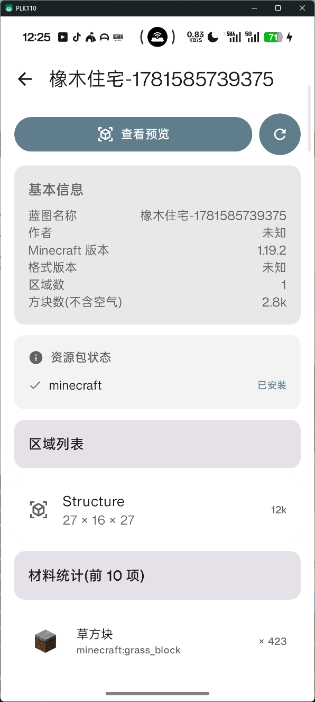
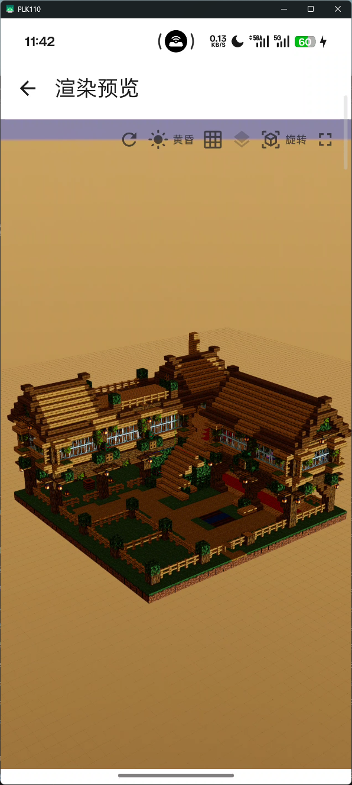
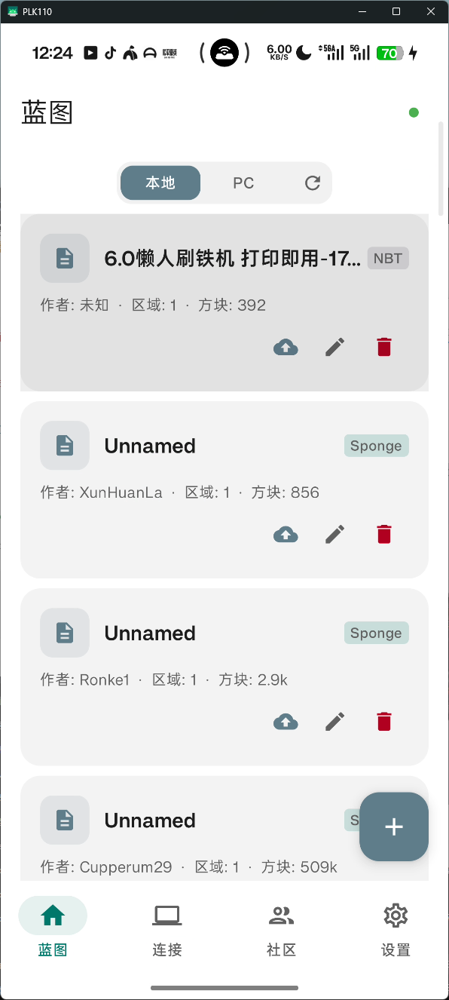

<p align="center">
  
</p>

<h1 align="center">BlockPrint Cat</h1>

<p align="center">Android 端 Minecraft 蓝图管理与 3D 预览工具</p>

<table>
<tr>
  <td></td>
  <td></td>
  <td></td>
</tr>
</table>

## 功能

- **本地蓝图管理** — 导入 `.litematic` / `.schematic` / `.nbt` 文件，浏览、重命名、删除
- **PC 端连接** — 通过局域网实时连接 PC 端模组，双向同步蓝图文件
- **3D 预览** — 基于 SceneView 的实时渲染，支持分层逐层查看
- **社区蓝图** — 浏览和下载 MCS / CMS 社区的蓝图作品
- **模组方块支持** — 支持渲染模组方块，特别支持Create

## 开发

```bash
# 克隆
git clone https://github.com/moxisuki/blockprint-cat.git

# 构建
./gradlew assembleDebug
```

依赖 [blockprint-core](https://github.com/moxisuki/blockprint-core) 解析蓝图并生成 GLB 模型。

配套 [PC 端模组](https://github.com/moxisuki/blockprint-link) 实现局域网实时同步。
