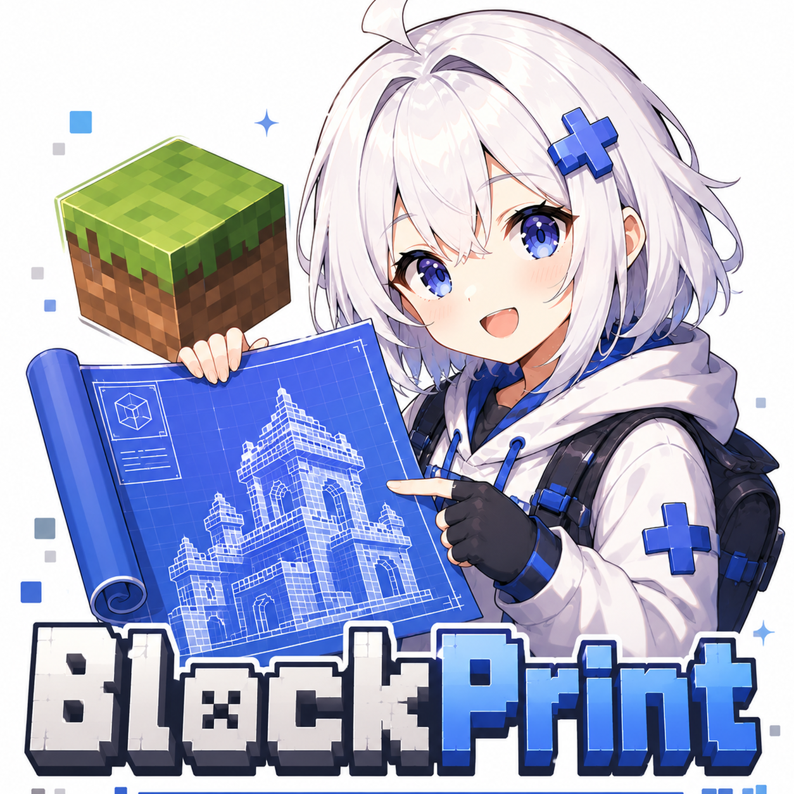
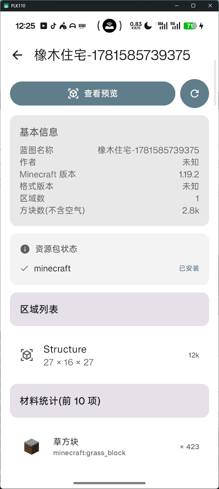
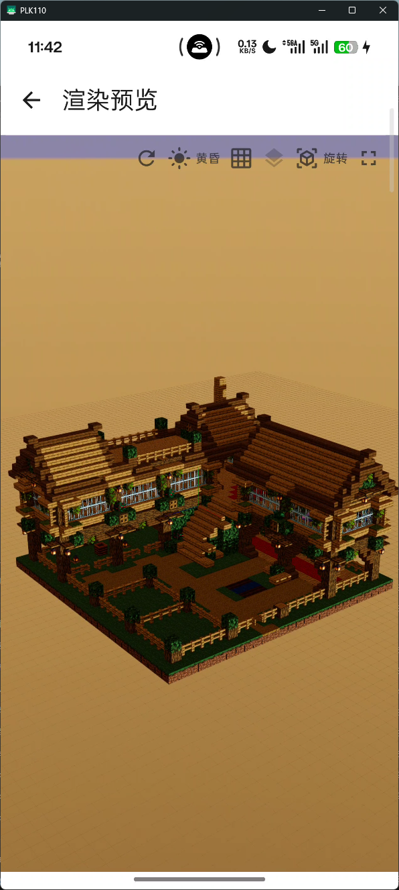
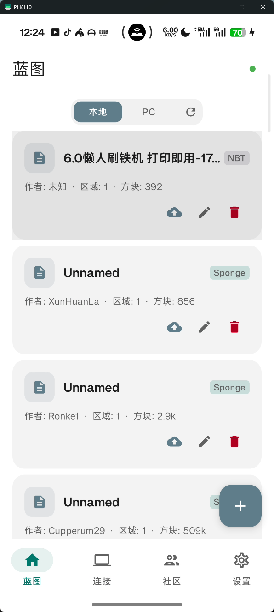

<p align="center">
  
</p>

<h1 align="center">BlockPrint Cat</h1>

<p align="center">Android 端 Minecraft 蓝图管理与 3D 预览工具</p>

<p align="center">
  <a href="https://crowdin.com/project/blockprint-cat"></a>
  <a href="https://github.com/moxisuki/blockprint-cat/actions/workflows/build.yml"></a>
</p>

<table>
<tr>
  <td></td>
  <td></td>
  <td></td>
</tr>
</table>

## 功能

- **本地蓝图管理** — 导入 `.litematic` / `.schematic` / `.nbt` 文件，浏览、重命名、删除
- **PC 端连接** — 通过局域网实时连接 PC 端模组，双向同步蓝图文件
- **3D 预览** — 基于 SceneView 的实时渲染，支持分层逐层查看
- **社区蓝图** — 浏览和下载 MCS / CMS 社区的蓝图作品
- **工具集** — 内置三种蓝图生成工具：
  - **图片转蓝图** — 将任意图片转换为可堆叠的 Minecraft 方块蓝图
  - **文字转蓝图** — 输入文字，8×8 位图字体或系统字体渲染生成方块蓝图
  - **方块绘画** — 逐格挑选方块，1×1 平铺绘制，所见即所得导出
- **分类管理 (v1.3.0+)**
  - 横滑分类卡片 + 8 色调色板 × 8 种像素图案封面
  - 长按卡片进入多选 → 批量移动 / 删除
  - 删分类时蓝图自动归到"未分类"，零数据丢失
- **模组方块支持** — 支持渲染模组方块，特别支持 Create

## 开发

```bash
# 克隆
git clone https://github.com/moxisuki/blockprint-cat.git

# 构建
./gradlew assembleDebug
```

依赖 [blockprint-core](https://github.com/moxisuki/blockprint-core) 解析蓝图并生成 GLB 模型。

配套 [PC 端模组](https://github.com/moxisuki/blockprint-link) 实现局域网实时同步。
